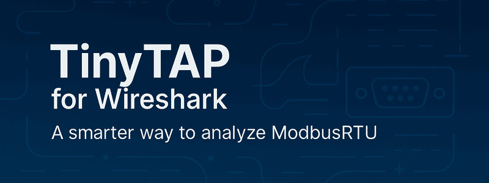

## TinyTAP for Wireshark  

TinyTAP is a lightweight embedded tool that monitors ModbusRTU serial communication and streams frame-level raw data in real time – ready for analysis via a custom Wireshark dissector.

It offers a smarter way to observe, filter, and forward serial traffic – ideal for diagnostics, development, and reverse engineering of Modbus-based systems.

> No virtual COM ports. No device drivers. Just clean data on the loopback interface.

A minimal CLI tool receives the raw stream from TinyTAP and forwards it to the loopback interface, where a dedicated Wireshark dissector (included in this project) interprets the data.
